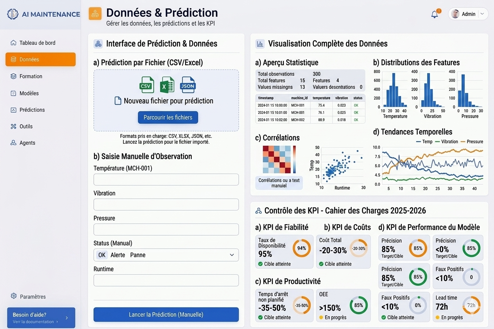
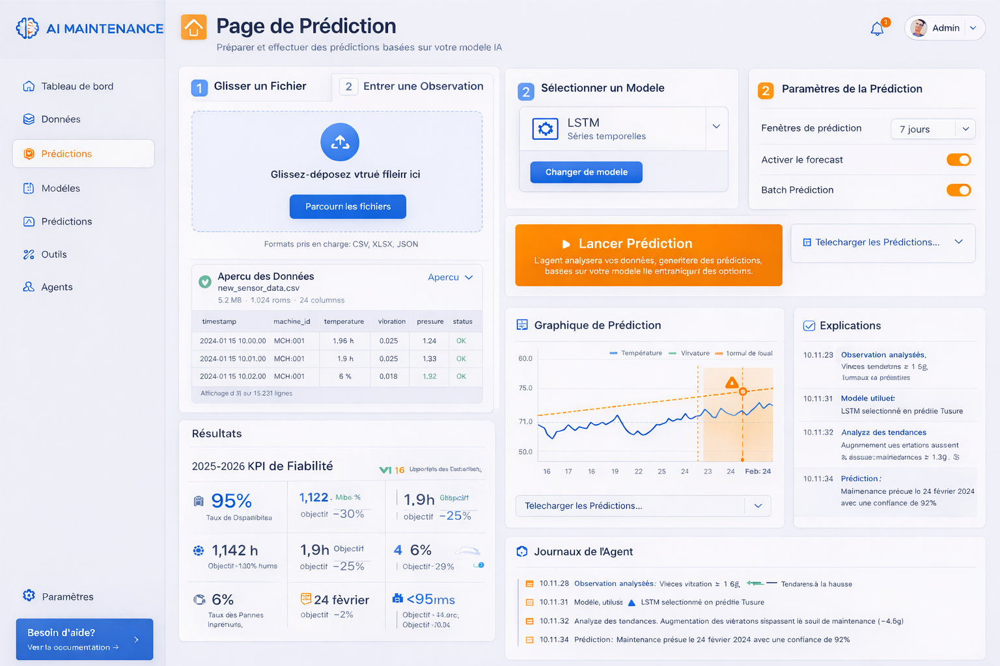
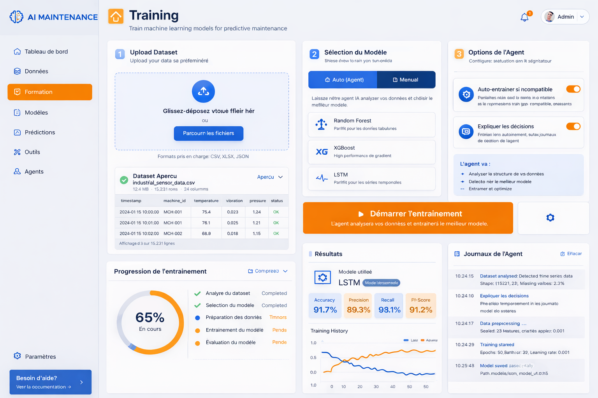
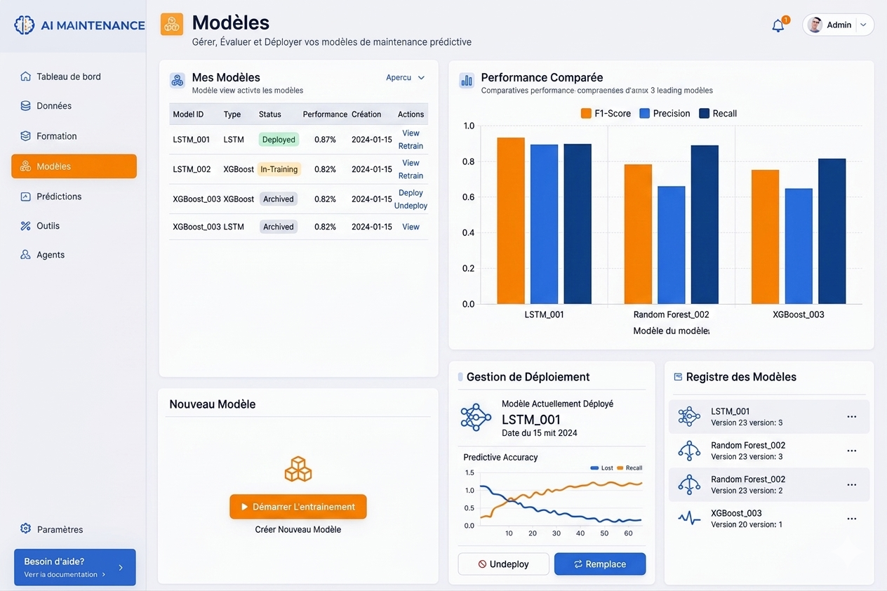

# Maintenance Predictive Industrielle

## Presentation du projet

Ce depot contient l'essentiel de notre travail sur la maintenance predictive, dont l'objectif est d'anticiper les dysfonctionnements des equipements industriels, d'assurer la continuite de la production, d'eviter les pannes non planifiees, de preserver les equipements couteux et de planifier les interventions de maintenance de maniere proactive.

Le projet repose sur un modele de machine learning entraine sur des donnees de capteurs industriels, couple a un agent intelligent base sur LangChain et LangGraph, expose via une API FastAPI. Cet agent est capable de prendre des decisions autonomes : il peut detecter des anomalies dans les donnees entrantes, nettoyer un fichier soumis par l'utilisateur, lancer automatiquement l'entrainement d'un nouveau modele, sauvegarder ce modele et le rendre immediatement disponible pour la prediction, sans intervention manuelle.

---

## Jeu de donnees

Le projet s'appuie sur le jeu de donnees **Industrial Equipment Maintenance Data**, disponible sur Kaggle a l'adresse suivante :

[https://www.kaggle.com/datasets/mayurgadekar5555/industrial-equipment-maintenance-data?resource=download](https://www.kaggle.com/datasets/mayurgadekar5555/industrial-equipment-maintenance-data?resource=download)

Les donnees sont organisees en deux repertoires dans le depot, correspondant aux fichiers bruts telecharges depuis Kaggle.

### Description des colonnes

| Colonne | Description |
|---|---|
| Horodatage | Date et heure de l'enregistrement |
| Temperature (C) | Temperature de l'equipement en degres Celsius |
| Vibration (mm/s) | Niveau de vibration en millimetres par seconde |
| Pression (Pa) | Pression appliquee a l'equipement en Pascals |
| RPM | Rotations par minute de l'equipement |
| Maintenance requise | Indicateur binaire (Oui/Non) indiquant si une maintenance est necessaire |

### Cas d'usage

Ce jeu de donnees est adapte pour la detection d'anomalies, la modelisation predictive de la maintenance et l'analyse de series temporelles dans un contexte industriel et IoT.

---

## Architecture du projet

Le projet est en cours de developpement actif. Il est structure en deux grandes parties : un frontend React et un backend Python.

### Frontend

Le frontend est developpe en React avec TypeScript. Le design utilise CSS et Tailwind CSS pour une interface moderne. Il est compose des pages et modules suivants.

**Page Donnees** — `src/pages/Donnees/`

```
src/pages/Donnees/
├── index.tsx
├── donnees.css
├── types.ts
└── components/
    ├── PredictionCard.tsx
    ├── VisualisationCard.tsx
    └── KPICard.tsx
```

Cette page permet l'upload de fichiers CSV, Excel ou JSON, la saisie manuelle de donnees, la visualisation (histogrammes, scatter, heatmap, tendances SVG) et le suivi des KPI : fiabilite, couts, productivite et performance du modele.

----
## **Interface Data**

Voici la visualisation de la partie gestion des données dans l’application :


----

**Page Predictions** — `src/pages/Predictions/`

```
src/pages/Predictions/
├── index.tsx
├── predictions.css
├── types.ts
└── components/
    ├── Header.tsx
    ├── FileUploadCard.tsx
    ├── ResultsCard.tsx
    ├── ModelSelector.tsx
    ├── PredictionSettings.tsx
    ├── PredictionChart.tsx
    ├── ExplanationsCard.tsx
    ├── AgentLogs.tsx
    └── ActionButton.tsx
```

Cette page permet de soumettre un fichier, de selectionner un modele, de configurer les parametres de prediction et de consulter les resultats, le graphique de prediction et les journaux de l'agent.

----
##  **Interface Prediction**

Voici la visualisation de la partie prédiction du modèle dans l’application :


----

**Page Training** — `src/pages/Training/`

```
src/pages/Training/
├── index.tsx
├── training.css
├── types.ts
└── components/
    ├── DatasetUpload.tsx
    ├── TrainingProgress.tsx
    ├── ModelSelection.tsx
    ├── AgentOptionsCard.tsx
    ├── StartTrainingButton.tsx
    ├── ResultsCard.tsx
    └── AgentTrainingLogs.tsx
```
----
##  **Interface Training**

Voici la visualisation de la partie entraînement du modèle dans l’application :


----

Cette page gere l'upload du dataset, le suivi visuel de la progression de l'entrainement, la selection du modele (mode automatique ou manuel) et l'affichage des journaux de l'agent.

**Page Models** — `src/pages/Models/`

```
src/pages/Models/
├── index.tsx
├── models.css
├── types.ts
└── components/
    ├── Sidebar.tsx
    ├── Header.tsx
    ├── MesModeles.tsx
    ├── PerformanceComparee.tsx
    ├── NouveauModele.tsx
    ├── GestionDeploiement.tsx
    └── RegistreModeles.tsx
```

Cette page permet de consulter la liste des modeles entraines, de comparer leurs performances (F1, Precision, Recall), de gerer leur deploiement et de consulter le registre des modeles.

----

##  **Interface Model**

Voici la visualisation de la partie gestion du modèle dans l’application :



----

### Backend

Le backend est developpe en Python. Il expose une API via FastAPI et integre un agent intelligent construit avec LangChain et LangGraph.

L'agent est capable de :

- Verifier la coherence des donnees entrantes (nombre de colonnes, types, valeurs manquantes) et alerter ou corriger automatiquement en cas d'anomalie.
- Nettoyer un fichier soumis par l'utilisateur, afficher un rapport sur les valeurs manquantes et les anomalies detectees.
- Lancer automatiquement l'entrainement d'un modele lorsque les donnees le necessitent ou a la demande de l'utilisateur.
- Sauvegarder le modele entraine et l'ajouter au registre des modeles disponibles.
- Permettre a l'utilisateur d'utiliser immediatement le nouveau modele pour la prediction.

---

## Technologies utilisees

| Domaine | Technologie |
|---|---|
| Frontend | React, TypeScript, CSS, Tailwind CSS |
| Backend | Python, FastAPI |
| Agent IA | LangChain, LangGraph |
| Machine Learning | Modeles entraines sur le jeu de donnees Kaggle |
| Routage frontend | React Router (useNavigate) |

---

## Statut du projet

Le projet est actuellement en cours de developpement. Les pages Donnees, Predictions, Training et Models sont en cours d'implementation. L'integration de l'agent LangChain/LangGraph avec le backend FastAPI est en cours.

---

## Contributeurs

**HINIMDOU MORSIA GUITDAM**
Eleve ingenieur en Intelligence Artificielle et Technologie des Donnees, developpeur d'application.

**Nankouli Marc Thierry**
Eleve ingenieur en Intelligence Artificielle et Technologie des Donnees, developpeur d'application.

**Encadrant : Professeur Zaki**
