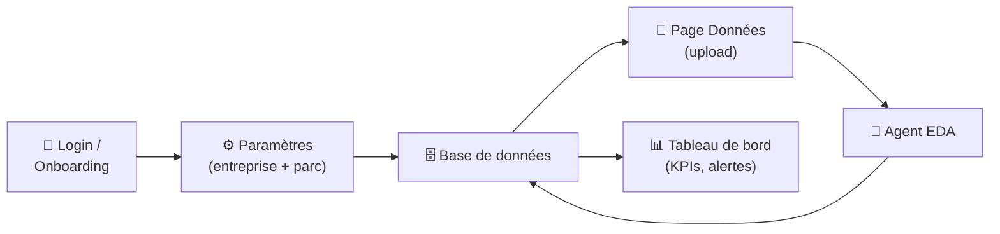
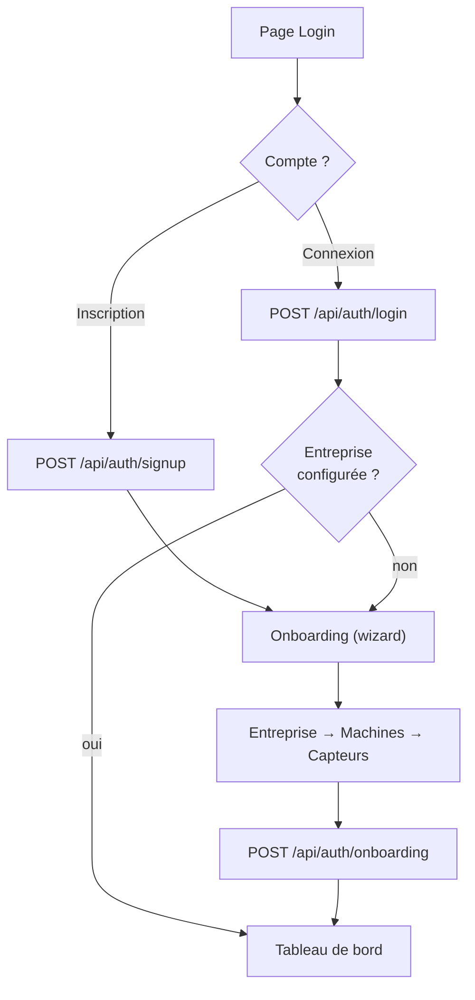
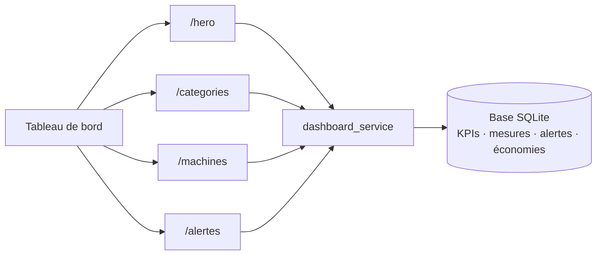
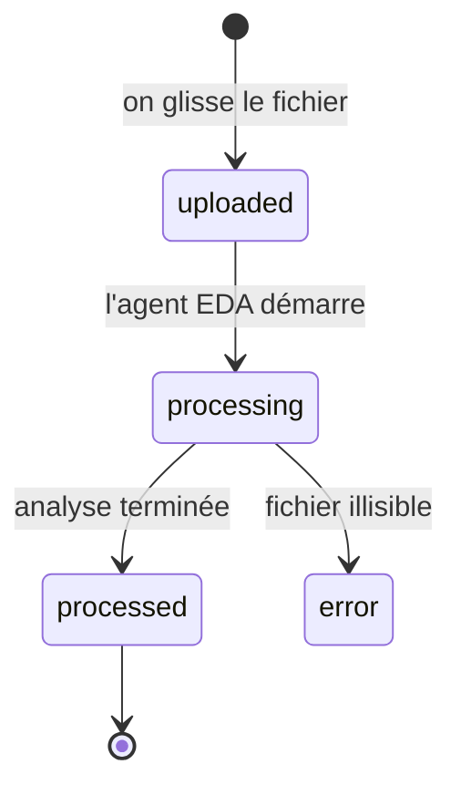
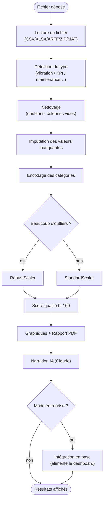

<!--
Présentation — Ma partie : Authentification, Paramètres, Dashboard, Données, Agent EDA
Format slides : chaque "---" sépare une diapositive (compatible Marp / reveal.js / Slides).
Les blocs "🎤 À dire" sont des notes d'oral (à ne pas afficher ou à mettre en commentaire).
-->

# AI Maintenance
## Ma partie : du compte utilisateur à l'analyse intelligente des données

**DJERI-ALASSANI OUBENOUPOU**
Élève ingénieur IA & Technologie des Données — Encadrant : Pr. Zaki

> Authentification · Paramètres · Tableau de bord · Page Données · Agent EDA

---

## Plan de ma partie

1. **Authentification & Onboarding** — entrer dans l'application
2. **Paramètres** — configurer son entreprise et son parc
3. **Tableau de bord** — piloter la santé du parc en un coup d'œil
4. **Page Données** — charger, analyser, explorer
5. **Agent EDA** — le moteur d'analyse automatique « derrière » la page Données

🎤 *À dire : « Ma partie couvre le parcours complet de l'utilisateur : il se connecte, configure son entreprise, puis exploite ses données — soit en temps réel via le tableau de bord, soit en chargeant un fichier qui passe par un agent d'analyse automatique. »*

---

## Vue d'ensemble — où se situe ma partie

🎤 *À dire : « Tout tourne autour de la base de données : l'onboarding et les paramètres la remplissent, l'agent EDA l'enrichit à partir des fichiers, et le tableau de bord la restitue. »*

---

## 1. Authentification & Onboarding

**Principe :** connexion simple, sans configuration technique pour l'utilisateur.

- **Inscription / Connexion** par email + mot de passe
- Mot de passe **haché en SHA-256** (jamais stocké en clair)
- Session conservée côté navigateur (clé `ai-maint-session`)
- **Rôles** : direction, responsable maintenance, analyste, technicien, administrateur

**Onboarding (1ère connexion) :** un assistant guide la création de l'entreprise.

🎤 *À dire : « À la première connexion, l'utilisateur n'a pas encore d'entreprise : on l'amène sur un wizard qui crée tout son environnement de travail. »*

---

## 1. Authentification — workflow

🎤 *À dire : « Le wizard crée en une fois l'entreprise, l'usine, l'atelier, les machines et les capteurs ; ensuite l'utilisateur arrive sur le tableau de bord. »*

---

## 2. Paramètres — configurer son environnement

**3 onglets :**

| Onglet | Rôle |
|---|---|
| 👤 **Profil** | informations de l'utilisateur (nom, poste, contact). |
| 🏭 **Entreprise** | secteur, adresse, contact de la société. |
| ⚙️ **Parc Machines** | **CRUD** des machines et de leurs capteurs. |

- Tout est **rattaché à l'entreprise** de l'utilisateur (cloisonnement multi-comptes).
- Le parc défini ici alimente directement le **tableau de bord** et la page **Données**.

🎤 *À dire : « Les paramètres, c'est le point d'entrée pour décrire son usine. Chaque machine et capteur ajouté ici devient visible partout ailleurs. »*

---

## 3. Tableau de bord — le poste de pilotage

**Objectif :** voir en un coup d'œil l'état de santé, les risques et la valeur générée.

**4 KPIs « héro » :**
- ✅ **Disponibilité** (%) sur 7 jours
- 💶 **Économies** prédictives (YTD, k€)
- ⚠️ **Machines en alerte**
- 🎯 **Taux de détection** prédictif

**+ La fleur des 9 piliers** (visualisation radiale cliquable).

🎤 *À dire : « Les 4 cartes du haut donnent l'essentiel : est-ce que ça tourne, est-ce que ça rapporte, qu'est-ce qui va mal, est-ce qu'on détecte bien. »*

---

## 3. Tableau de bord — la fleur des 9 piliers

| Pilier | Ce qu'il mesure |
|---|---|
| Revenue Recovery | économies, pannes évitées, ROI |
| **Asset Availability** | disponibilité, **TRS/OEE**, MTBF, MTTR |
| Risk Reduction | machines en zone D, défauts actifs, DRBF |
| Smart Replacement | remplacements optimisés |
| IoT Network | capteurs actifs, batterie, passerelles |
| Planned Maintenance | bons de travail (planifiés/en cours/terminés) |
| Service Loss | pannes, temps d'arrêt, pertes |
| Workforce | techniciens, certifications, interventions |
| Predictive Power | taux de détection, confiance, lead time |

🎤 *À dire : « Chaque pétale est un axe de performance ; en cliquant, on a le détail. Toutes ces valeurs viennent de la base, calculées sur 30 jours. »*

---

## 3. Tableau de bord — composants & flux

**Affiche aussi :** machines à risque (triées par urgence), alertes 24 h, tendance V-RMS, grille de santé ISO.

🎤 *À dire : « Le tableau de bord interroge plusieurs services en parallèle, chacun renvoyant un morceau : les KPIs, les piliers, les machines, les alertes. »*

---

## Indicateurs clés — définitions

| Indicateur | Formule | Sens |
|---|---|---|
| **Disponibilité** | MTBF / (MTBF + MTTR) | % de temps où la machine est utilisable |
| **MTBF** | temps de marche / nb pannes | fiabilité |
| **MTTR** | temps de réparation / nb interventions | réactivité |
| **TRS / OEE** | Dispo × Performance × Qualité | rendement global |
| **DRBF / RUL** | (seuil − valeur actuelle) / pente | jours avant défaillance |

🎤 *À dire : « Ces indicateurs sont standards en maintenance industrielle ; on les calcule à partir des mesures et des KPIs journaliers. »*

---

## 4. Page Données — vue d'ensemble

**Le cœur analytique de l'application.** Deux usages :

1. 📈 **Temps réel** — explorer les données de l'entreprise déjà en base
2. 📁 **Exploratoire** — charger un fichier (CSV, XLSX, TXT, ARFF, ZIP, MAT) et l'analyser

**Cycle complet :** `Upload → EDA automatique → Exploration → (option) Intégration en base`

🎤 *À dire : « La page Données sert à deux choses : analyser un nouveau jeu de données, ou explorer celles déjà présentes. »*

---

## 4. Page Données — cycle de vie d'un dataset

- Pendant le traitement, l'interface **se met à jour automatiquement** (rafraîchissement toutes les 3 s).
- **2 modes** : *EDA exploratoire* (analyse seule) ou *Entreprise* (les données alimentent le tableau de bord).

🎤 *À dire : « L'utilisateur dépose son fichier et voit le statut évoluer en direct, sans recharger la page. »*

---

## 4. Page Données — les sous-pages

| Sous-page | Ce qu'on y voit |
|---|---|
| **Chargement** | dépôt du fichier + liste des datasets |
| **Vue Générale** | rapport EDA complet (qualité, graphiques, narration IA) |
| **Analyse Vibratoire** | zones ISO, spectre FFT, défauts de roulements (BPFO/BPFI/BSF) |
| **Pronostic & DRBF** | durée de vie restante, courbe de dégradation |
| **KPIs & Performance** | MTBF, MTTR, OEE, Pareto |
| **Parc Machines** | tableau filtrable des machines |
| **Capteurs IoT** | état, batterie, types |
| **Classification VIS** | NORMAL / ATTENTION / CRITIQUE / URGENCE |

> Une sous-page ne s'active que si le **type de données détecté** est compatible.

🎤 *À dire : « Selon le type de fichier détecté — vibratoire, KPI, maintenance… — on débloque les analyses pertinentes. »*

---

## 5. Agent EDA — qu'est-ce que c'est ?

**EDA = Exploratory Data Analysis (analyse exploratoire automatique).**

C'est le **moteur intelligent derrière la page Données** : à chaque fichier déposé, il fait, **tout seul**, le travail d'un data analyst :

- 🧹 nettoie et prépare les données
- 📏 calcule un **score de qualité (0–100)**
- 📊 génère des graphiques
- 🤖 rédige une **analyse experte** (narration IA, normes ISO)
- 📄 produit un **rapport PDF**

🎤 *À dire : « L'idée forte : l'utilisateur n'a aucune compétence technique à avoir. Il dépose un fichier, l'agent fait l'analyse complète et lui parle en clair. »*

---

## 5. Agent EDA — le pipeline (workflow)

🎤 *À dire : « Le pipeline s'adapte aux données : par exemple, s'il y a beaucoup de valeurs extrêmes, il choisit un autre mode de normalisation. »*

---

## 5. Agent EDA — le score de qualité

Un dataset démarre à **100 points**, puis on retire des pénalités :

| Problème | Pénalité max |
|---|---|
| Valeurs manquantes | −30 |
| Doublons | −10 |
| Valeurs aberrantes (outliers) | −30 |
| Distributions très asymétriques | −10 |

➡️ **Label** : Excellent (≥85) · Bon (≥70) · Acceptable (≥50) · Insuffisant (<50)

🎤 *À dire : « Ce score donne immédiatement confiance — ou non — dans le jeu de données, avant même de l'utiliser pour des prédictions. »*

---

## 5. Agent EDA — l'analyse experte (IA)

L'agent envoie le contexte à **Claude**, avec un prompt **adapté au type de données** :

- injection des **normes ISO** pertinentes (10816, 18436…)
- mise en avant du **score qualité** et des colonnes problématiques
- sortie structurée : synthèse, audit, analyse, **recommandations de variables** (à garder / dériver / exclure)

> Résultat : un rapport lisible par un non-spécialiste, avec des références normatives.

🎤 *À dire : « La force de l'agent, c'est qu'il ne fait pas que des chiffres : il explique, cite les normes, et recommande quoi faire des données. »*

---

## Ce que ma partie apporte — synthèse

| Brique | Apport |
|---|---|
| 🔐 Auth & Onboarding | accès simple + création guidée de l'environnement |
| ⚙️ Paramètres | description du parc, cloisonné par entreprise |
| 📊 Tableau de bord | pilotage temps réel (4 KPIs + 9 piliers) |
| 📁 Page Données | upload + 7 analyses spécialisées |
| 🤖 Agent EDA | analyse automatique + qualité + narration IA |

➡️ **Un parcours complet : de la connexion à la décision, sans expertise technique requise.**

🎤 *À dire : « En résumé, ma partie transforme un simple fichier ou un parc de machines en informations exploitables pour décider. »*

---

## Démonstration (proposée)

1. Connexion → onboarding express (1 entreprise, 1 machine)
2. Paramètres → ajout d'une machine + capteur
3. Page Données → upload d'un dataset vibratoire
4. Suivi du statut → rapport EDA (qualité, graphiques, narration)
5. Tableau de bord → KPIs et alertes mis à jour

🎤 *À dire : « Je vous propose de dérouler ce scénario en live pour montrer l'enchaînement complet. »*

---

# Merci !
### Questions ?

*AI Maintenance — Authentification · Paramètres · Dashboard · Données · Agent EDA*
